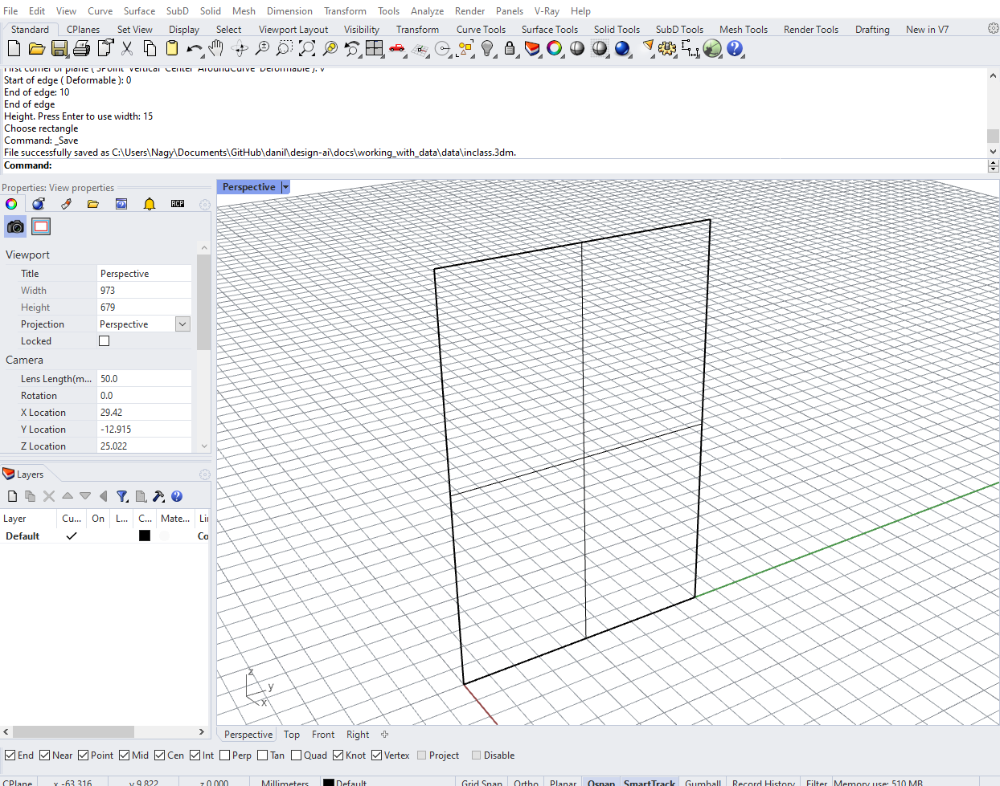
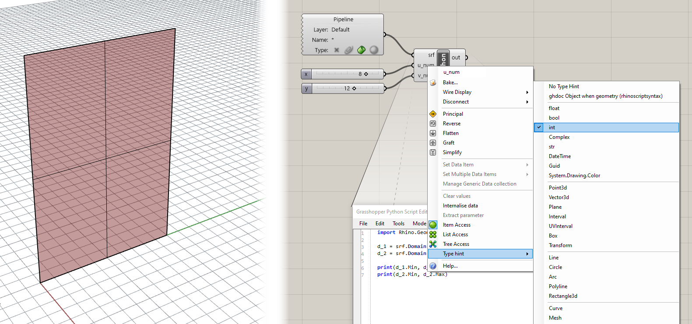
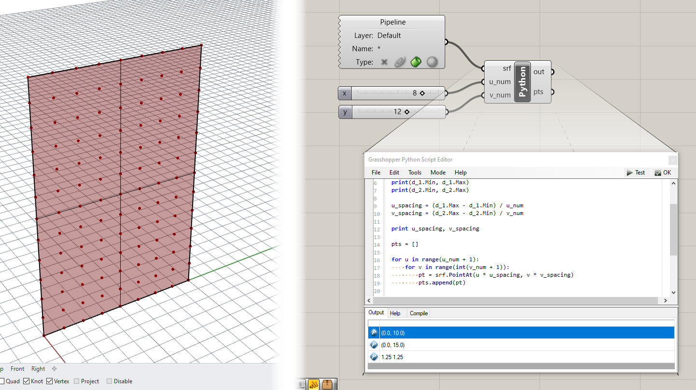
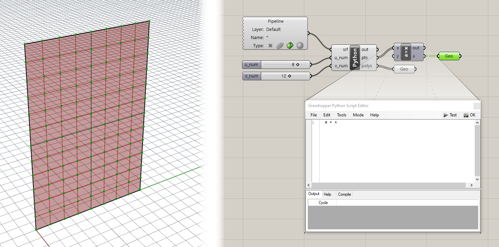
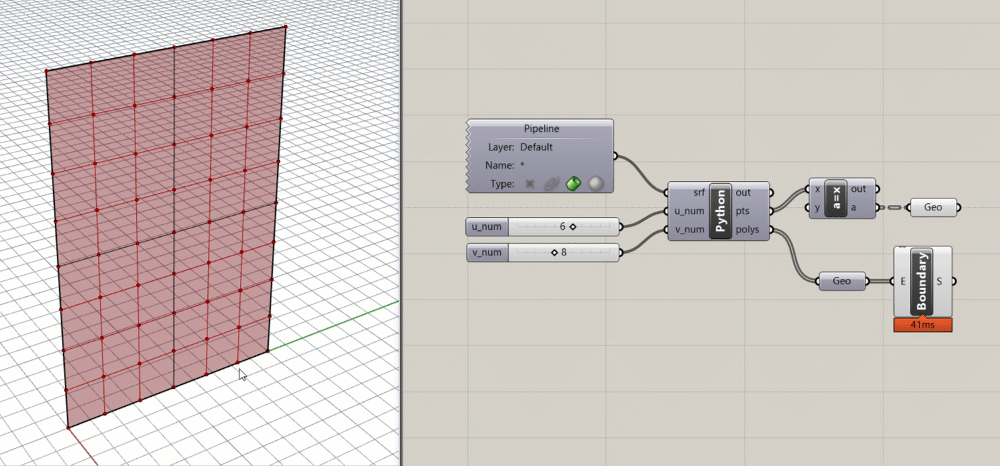
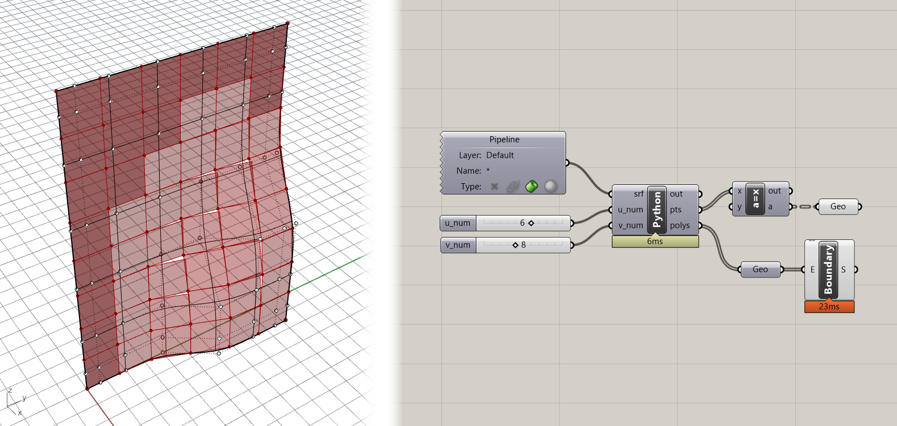
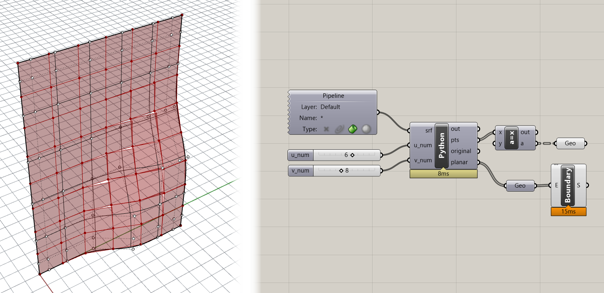
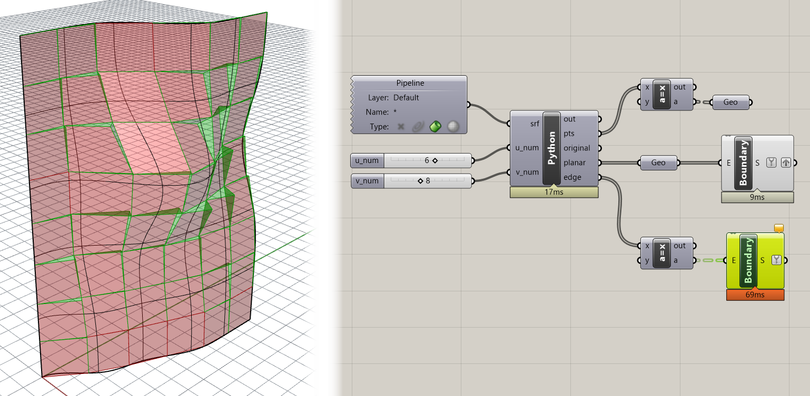
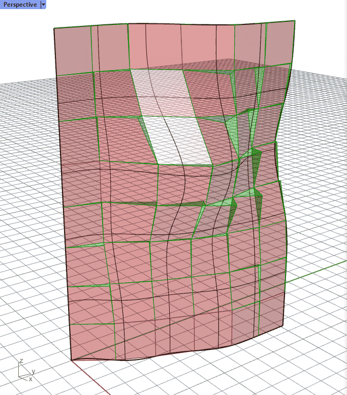
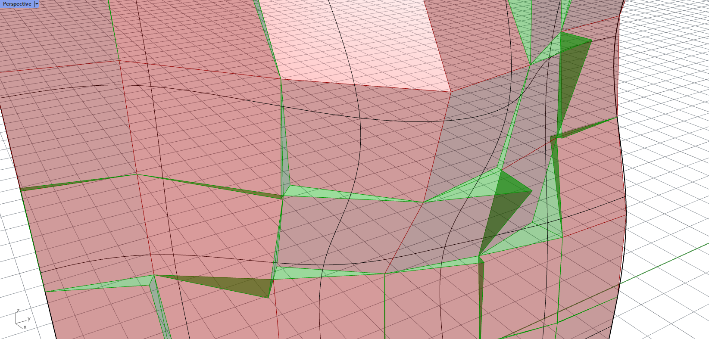

# Working with data

In this tutorial we will develop a parametric facade to explore various issues and techniques in working with data in Python.

Files you will need for this tutorial:

| Start with these files          | In case you get lost, you can download the final solution here |
| :------------------------------ | :------------------------------------------------------------- |
| [1_start.3dm](data/1_start.3dm) | [1_end.3dm](data/1_end.3dm)                                    |
| [1_start.gh](data/1_start.gh)   | [1_end.gh](data/1_end.gh)                                      |

## Introduction

### Step 1. Create the surface

The first step is to create a surface which will define our facade. We will model this as a `Surface` object in Rhino and import it into Grasshopper so we can work with it in Python. To create the `Surface`, use the `Plane` command in Rhino to create a vertical `Surface` 10 units wide and 15 units high.

{: .note-title }

> Tip
>
> Use the context menus in the Rhino command line to change the way a command behaves as it's being executed. To create a vertical surface of a given dimension, you can issue the following commands in the Rhino command prompt in order, pressing `Enter` after each line:
>
> ```
> Plane
> V (for "Vertical")
> 0 (to start at origin)
> 10 (to lock the first dimension at 10 units, then click in the view to set the plane's base curve.)
> 15 (to lock the height, click on the canvas to confirm direction.)
> ```



Next, let's use a `Geometry Pipeline` component to bring the Surface into Grasshopper, making sure that you've selected the proper geometry type and entered the name of the layer the surface is on. Now, plug the output of the `Geometry Pipeline` component into one of the inputs of a new `Python` component. You can rename the input as you wish, just remember that the surface will be available through that variable name in the Python code. Also remember to set the _Type hint_ to **Surface** so that you can work directly with the object's geometry.


### Step 2. Create the point grid

Let's start developing the code for this example. Double-click the `Python` component to open the code editor. Delete any code already there and on the first line import the `Rhino.Geometry` library:

```python
import Rhino.Geometry as rh
```

The first thing we need to do to build the facade is to arrange a two-dimensional grid of points evenly across the surface. These grid points will define the corners of the facade panels. To create the grid points we will use a double `for` loop similar to the [previous example](https://design-ai.net/docs/setup/). However, this time we will not be setting the spacing of the grid through a parameter. Instead, the spacing will be dictated by the desired number of panels in each direction as well as the dimensions of the surface itself.

To understand the spacing of the points on the grid, we need to know about its _Domain_ or the extents of the surface within its two-dimensional local coordinate system. This local coordinate system is unique to each surface, and any point on the surface can be designated as a location along its two dimensions. These dimensions are typically designated as `U` and `V` to differentiate from the `X`, `Y`, and `Z` coordinates of the three-dimensional global coordinate system.

{: .note }
Locating a point on a surface based on its local coordinate system should not be unfamiliar. It is the same way we locate places on the Earth. If we want to describe the location of a place we don't use it's absolute `XYZ` coordinates in the 3d space of the universe relative to the sun. Instead we use two coordinates (latitude and longitude) which run in two directions along the surface of the Earth. In a similar way, understanding curvature and local coordinate systems will help us locate points on the surface to place our panels.

To get the domain of the surface in its two directions, use the [`Domain()`](https://developer.rhino3d.com/api/RhinoCommon/html/M_Rhino_Geometry_Surface_Domain.htm) method of the [`Surface`](https://developer.rhino3d.com/api/RhinoCommon/html/T_Rhino_Geometry_Surface.htm) Class. This method takes in one input which is the direction (integer 0 or 1) and returns an instance of the [`Domain`]() class. You can print the `Min` and `Max` properties of the resulting `Domain` object to see that they represent the extents of the surface ([0,10] representing the 10 unit width and [0,15] representing the 15 unit height).

```python
d_1 = srf.Domain(0)
d_2 = srf.Domain(1)

print(d_1.Min, d_1.Max)
print(d_2.Min, d_2.Max)
```

This should print something like this to the Output console:

```
(0.0, 10.0)
(0.0, 15.0)
```

Now that we have the domains of the surface, we can calculate the spacing to use between points as we lay out the grid. First, create two new inputs for the `Python` component in Grasshopper called `u_num` and `v_num` and set their _Type hint_ to **int**. These inputs will control the number of panels generated in both directions along the surface.



Now you can use the domain of the surface as well as the new parameters to calculate the spacing of points in both directions:

```python
u_spacing = (d_1.Max - d_1.Min) / u_num
v_spacing = (d_2.Max - d_2.Min) / v_num

print u_spacing, v_spacing
```

Finally, we can create our nested `for` loops to iterate over the two directions of the grid. This is similar to the code from the [last exercise](https://design-ai.net/docs/setup/#setting-up-the-grid), except instead of creating a `Point3d` directly with `XYZ` coordinates we are extracting a point from the surface with local `UV` coordinates. To space the points evenly along the surface we are using the calculated `u_spacing` and `v_spacing` which represent the distance between each point in local coordinates. Write the following code to create the grid of points:

```python
pts = []

for u in range(u_num + 1):
    for v in range(int(v_num + 1)):
        pt = srf.PointAt(u * u_spacing, v * v_spacing)
        pts.append(pt)
```

Notice that when we create a set of integers to iterate over using the `range()` function, we are adding 1 to both `u_num` and `v_num`. This is because we need to generate one extra row and column of points to make sure we have enough points to generate all the panels required.

Make sure you have an output called `pts` created on the `Python` component. You should now see the grid of points laying evenly along the surface.



### Step 4. Create the panels

Now that we have our surface points generated we will start to generate the geometry of the panel itself. We will start by drawing a `Polyline` representing the exterior outline of each panel.

Right now our points are stored sequentially in a single list. This will make it difficult to access them in a structured way while generating the panel `Polylines`. To make this job easier, we will rework our data structure so that `pts` is a list of lists, each of which represents just the points in a single row of the grid. Below is the full code to this point (the changed lines are marked with comments):

```python
import Rhino.Geometry as rh

d_1 = srf.Domain(0)
d_2 = srf.Domain(1)

print(d_1.Min, d_1.Max)
print(d_2.Min, d_2.Max)

u_spacing = (d_1.Max - d_1.Min) / u_num
v_spacing = (d_2.Max - d_2.Min) / v_num

print u_spacing, v_spacing

pts = []

for u in range(u_num + 1):
    pts.append([]) ## for each row, we  first add an empty list
    for v in range(int(v_num + 1)):
        pt = srf.PointAt(u * u_spacing, v * v_spacing)
        pts[-1].append(pt) ## after creating a new point we add it to the last list (representing the current row)
```

Now that the points are in a more useful structure, let's start to generate the panel geometry. First we'll create an empty list to store the generated `Polylines`. Below your current code and outside of any loops add the line:

```python
polys = []
```

Next, we'll iterate over the nested list structure of the `pts` variable, again with two loops. The outer loop will iterate over the lists representing each row of the grid, while the inner loop will iterate over each point in that list:

```python
for i, row in enumerate(pts[:-1]):
    for j, pt_1 in enumerate(row[:-1]):
```

Notice that when we iterate over the `pts` list as well as each `row`, we are taking all elements except for the last. This is because we actually want to create one less panel in each direction than we have points.

Notice also that we are using `enumerate()` here, which gives us access to two variables for each loop, one that represents the index of an item in a list, and one that represents the item itself. This means inside of our inner loop we will have access to the following variables:

- `i` - the index of the row
- `j` - the index of the item in the row
- `row` - the row itself
- `pt_1` - the current point in the current row

Using these variables, let's write code within the inner loop (indented two times) to get the other three points defining each panel:

```python
        pt_2 = row[j+1]
        next_row = pts[i+1]
        pt_3 = next_row[j+1]
        pt_4 = next_row[j]

        poly = rh.PolylineCurve([pt_1, pt_2, pt_3, pt_4, pt_1])
        polys.append(poly)
```

Make sure you use the right indices based on the `i` and `j` variables for the right points so that they are in the proper order going around each panel. If the points are in the wrong order the `Polylines` may appear distorted or twisted when you view them in Rhino.

If you have an output called `polys` created on the `Python` component you should now see the `Polylines` defining the boundary of each facade panel.

{: .note }

> You might have noticed that the points went away in the Rhino viewport 😱. This is because Grasshopper has trouble visualizing datasets exported from Python using nested loops. To view these geometries in Grasshopper quickly you can use a hack. Create a new Python component and copy and paste a single line of code into the script:
>
> ```python
> a = x
> ```
>
> Then connect the nested list output into the `X` input. The `A` output should now be the same data but structured in a Grasshopper-friendly Data Tree, with each nested list of points organized on its own branch. As a bonus you should now see the point geometry rendered in the Rhino viewport once again.



To visualize the geometry of the panels we can use the `Boundary Surfaces` component in Grasshopper to create a planar surface within each `Polyline` boundary. At this point it might be interesting to try to rebuild the surface with more control points and then deform the surface shape by moving its control points. Notice how as you deform the surface, certain areas of panels disappear. This is because as the points move on the deformed surface, the four points defining the corners of each panel do not necessarily stay coplanar, which causes the `Boundary Surfaces` component to fail.



### Step 5. Make the panels planar

For the final code portion of this exercise we will fix this issue by enforcing planarity in the panels. Making things planar is a big deal in the field of rationalization, which deals with refining geometry to make it more buildable. This is because most building materials come in flat sheets, so the closer you can approximate a shape with a planar surface the cheaper it is, generally, to build.

There are several approaches you can take to ensuring that the panels are planar, each of which might result in somewhat different panel shapes. For this example, our approach will be to construct a plane using three of the four corner points, and then projecting the fourth corner point onto this plane. This will by definition ensure that the four points are coplanar, while only moving one of the four points.

Add the following code below your current script, still within the inner `for` loop (indented two times):

```python
        pt_5 = rh.Point3d(pt_3)
        pl = rh.Plane(pt_1, pt_2, pt_4)
        t = rh.Transform.PlanarProjection(pl)
        pt_5.Transform(t)

        planar_poly = rh.PolylineCurve([pt_1, pt_2, pt_5, pt_4, pt_1])
        polys.append(planar_poly)
```

You should now see another set of panels overlapping the previous. If you have a deformed surface you should see doubled panels in flat areas of the surface and new planar panels in curved areas.



We are seeing overlapping panels because we are adding both the original `Polyline` as well as the new flattened one to the `polys` list. Because we are now generating multiple items for each panel, we can organize the data a little better using dictionaries. Modify the double loop in the script so that `polys` is a list of dictionaries, each of which has two keys to store the two generated `Polylines`:

```python
polys = []

for i, row in enumerate(pts[:-1]):
    for j, pt_1 in enumerate(row[:-1]):

        polys.append({}) ## add an empty dictionary to the list

        pt_2 = row[j+1]
        next_row = pts[i+1]
        pt_3 = next_row[j+1]
        pt_4 = next_row[j]

        poly = rh.PolylineCurve([pt_1, pt_2, pt_3, pt_4, pt_1])
        polys[-1]["original"] = poly ## store original poly in the last dictionary with a key

        pt_5 = rh.Point3d(pt_3)
        pl = rh.Plane(pt_1, pt_2, pt_4)
        t = rh.Transform.PlanarProjection(pl)
        pt_5.Transform(t)

        planar_poly = rh.PolylineCurve([pt_1, pt_2, pt_5, pt_4, pt_1])
        polys[-1]["planar"] = planar_poly ## store planar poly with a different key
```

Now that the data is stored within dictionaries we need to retrieve it and put it into a simple list that can be passed to Grasshopper and visualized in Rhino (and to avoid the hack we saw earlier). Let's create two new variables, `original` and `planar`, to store the geometries as flat lists. To fill the two lists we can use [list comprehnesions](https://docs.python.org/3/tutorial/datastructures.html#list-comprehensions), a particularly useful feature of Python which can create a sort of one-line loop. Under your existing code and outside the two loops, type:

```python
original = [poly["original"] for poly in polys]
planar = [poly["planar"] for poly in polys]
```

Now if you have the corresponding named outputs on the `Python` component you should see the geometry in the Rhino viewport. Connect the `Polylines` stored in the `planar` variable to the `Boundary Surfaces` component to ensure that the new panel outlines are indeed planar.



### Step 6. Finish the panels

To finish off the panels, let's create two additional triangular surfaces to close the gap that is produced when the panel's corner point gets moved to be planar. Add the following code within the inner `for` loop:

```python
        polys[-1]["edge"] = []
        if pt_3.DistanceTo(pt_5) > 0.01:
            polys[-1]["edge"].append(rh.PolylineCurve([pt_2, pt_5, pt_3, pt_2]))
            polys[-1]["edge"].append(rh.PolylineCurve([pt_4, pt_3, pt_5, pt_4]))
```

This code will create two additional `Polylines` that represent the triangular side pieces that connect the moved corner back to the surface. The code first checks whether the point was moved by measuring the distance between the original point and the moved version. If the point moved a sufficient amount then the `Polylines` are generated.

To send the new `Polylines` back to Grasshopper, add this to the end of the script below the other list comprehensions:

```python
edge = [poly["edge"] for poly in polys]
```

Your final code for this tutorial should now be:

```python
import Rhino.Geometry as rh

d_1 = srf.Domain(0)
d_2 = srf.Domain(1)

print(d_1.Min, d_1.Max)
print(d_2.Min, d_2.Max)

u_spacing = (d_1.Max - d_1.Min) / u_num
v_spacing = (d_2.Max - d_2.Min) / v_num

print u_spacing, v_spacing

pts = []

for u in range(u_num + 1):
    pts.append([]) ## for each row, we  first add an empty list
    for v in range(int(v_num + 1)):
        pt = srf.PointAt(u * u_spacing, v * v_spacing)
        pts[-1].append(pt) ## after creating a new point we add it to the last list (representing the current row)

polys = []

for i, row in enumerate(pts[:-1]):
    for j, pt_1 in enumerate(row[:-1]):

        polys.append({}) ## add an empty dictionary to the list

        pt_2 = row[j+1]
        next_row = pts[i+1]
        pt_3 = next_row[j+1]
        pt_4 = next_row[j]

        poly = rh.PolylineCurve([pt_1, pt_2, pt_3, pt_4, pt_1])
        polys[-1]["original"] = poly ## store original poly in the last dictionary with a key

        pt_5 = rh.Point3d(pt_3)
        pl = rh.Plane(pt_1, pt_2, pt_4)
        t = rh.Transform.PlanarProjection(pl)
        pt_5.Transform(t)

        planar_poly = rh.PolylineCurve([pt_1, pt_2, pt_5, pt_4, pt_1])
        polys[-1]["planar"] = planar_poly ## store planar poly with a different key

        polys[-1]["edge"] = []
        if pt_3.DistanceTo(pt_5) > 0.01:
            polys[-1]["edge"].append(rh.PolylineCurve([pt_2, pt_5, pt_3, pt_2]))
            polys[-1]["edge"].append(rh.PolylineCurve([pt_4, pt_3, pt_5, pt_4]))

original = [poly["original"] for poly in polys]
planar = [poly["planar"] for poly in polys]
edge = [poly["edge"] for poly in polys]
```

You can use a `Boundary Surfaces` component again to create surfaces from the edge `Polylines`, which should produce results similar to these:



If you get stuck anywhere along the way, you can download the finished model using the link above.

{: .challenge-title }

> Challenge 1
>
> Can you modify the code so that instead of the same point being chosen to be projected each time, the point is chosen which needs to be moved the least in order to make the panel planar? This is another kind of optimization since minimally moving the points would also cause the panels to follow the geometry closer and would minimize the material required for the side panels.
>
> 

{: .challenge-title }

> Challenge 2
>
> Currently, the direction we move the corner point is based on the nearest distance to the plane we're projecting it to. Can you modify the code so that the corners always move in the same direction as the normal at that point on the surface? This is a further optimization because it will ensure that the panel side edges line up between adjacent panels.
>
> 
