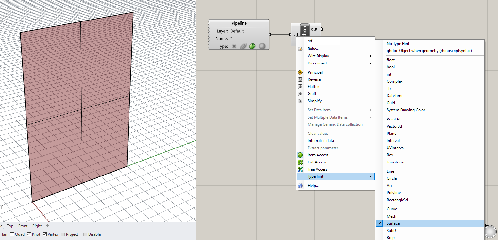

# Working with data

In this tutorial we will develop a parametric facade to explore various issues and techniques in working with data in Python.

Files you will need for this tutorial:

| Start with these files          | In case you get lost, you can download the final solution here |
| :------------------------------ | :------------------------------------------------------------- |
| [1_start.3dm](data/1_start.3dm) |                                                                |
| [1_start.gh](data/1_start.gh)   | [1_end.gh](data/1_end.gh)                                      |

## Introduction

### Step 1. Create the surface

The first step is to create a Surface which will define our facade. We will model this as a surface in the Rhino model and import it into Grasshopper so that we can later modify the surface and have the facade respond. To create the Surface object, use the `Plane` command in Rhino to create a vertical surface 10 units wide and 15 units high.

{: .note-title }

> Tip
>
> Use the context menus in the Rhino command line to change the way a command behaves as it's being executed. To create a vertical surface of a given dimension, you can issue the following commands in the Rhino command prompt in order, pressing `Enter` after each line:
>
> ```
> Plane
> V (for "Vertical")
> 0 (to start at origin)
> 10 (to lock the first dimension at 10 units, then click in the view to set the plane's base curve.)
> 15 (to lock the height, click on the canvas to confirm direction.)
> ```


Now that we have the surface modelled we need to first import it into Grasshopper and then pass it into a `Python` component so we can start to work with it. First, use a `Geometry Pipeline` component to bring in the the surface by Layer name, then plug it into one of the inputs of a `Python` component. You can rename the input as you with, just remember that the surface will be available through that variable name in the Python code. Also remember to set the _Type hint_ to **Surface** so that you can work directly with the geometry object.



### Step 2. Get the surface Domains

Get domains from surface

### Step 3. Create the grid

double loop to extract nested lists of points from surface

### Step 4. Create the panels

Iterate over grid to create panel outlines - polylines, store in list and output to grasshopper

Planar surf panels

Move surface, observe that outlines break planarity

### Step 5. Make the panels planar

Ensure boundaries are planar - project corner point to plane along x-axis

Store new boundary in dict data structure

Extract both boundaries to gh

Ensure planar srf works

### Step 6. Model the panels

Loft to create edges

Offset

Extrude

Planar surf - panels still planar

{: .challenge-title }

> Challenge 1
>
> extrude along panel normal.

{: .challenge-title }

> Challenge 2
>
> move minimal corner.

## Conclusion
